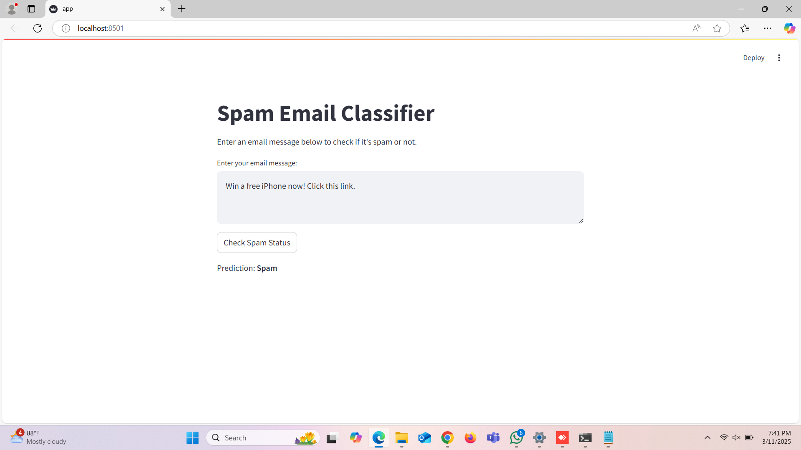

# Spam Email Classifier

A simple web application built with Streamlit that classifies emails as spam or not spam.

## Overview

This application uses a machine learning model trained to identify spam emails. Users can input email text, and the application will classify it as either "Spam" or "Not Spam" based on the content.

## Features

- Clean, user-friendly interface
- Real-time classification of email text
- Pre-trained machine learning model for accurate spam detection

## Screenshot



## Prerequisites

Before running this application, make sure you have the following:

- Python 3.7+
- Required Python packages (see requirements.txt)
- Trained model files:
  - `spam_classifier.pkl` (The trained classification model)
  - `vectorizer.pkl` (The TF-IDF vectorizer used for text processing)

## Installation

1. Clone this repository or download the source code:
   ```
   git clone <repository-url>
   ```

2. Install the required packages:
   ```
   pip install -r requirements.txt
   ```

## Usage

1. Ensure both model files (`spam_classifier.pkl` and `vectorizer.pkl`) are in the same directory as the application.

2. Run the Streamlit application:
   ```
   streamlit run app.py
   ```

3. Open your web browser and navigate to the local URL provided by Streamlit (typically http://localhost:8501).

4. Enter an email message in the text area and click "Check Spam Status" to see the prediction.

## How It Works

1. The application loads pre-trained machine learning models.
2. When a user submits an email for classification:
   - The text is preprocessed (converted to lowercase, punctuation removed)
   - The text is transformed using a TF-IDF vectorizer
   - The machine learning model predicts whether the email is spam or not
   - The result is displayed to the user

## Project Structure

```
├── app.py                  # Main Streamlit application
├── spam_classifier.pkl     # Trained classification model
├── vectorizer.pkl          # TF-IDF vectorizer
├── requirements.txt        # Required Python packages
├── README.md               # This file
└── outputs/                # Folder containing screenshots
    └── output.png          # Application screenshot
```

## Requirements

- streamlit
- scikit-learn
- pandas
- numpy
- pickle

## Future Improvements

- Add confidence scores for predictions
- Include a feature to train the model on custom datasets
- Add more detailed analysis of why an email was classified as spam
- Implement a batch processing feature for multiple emails

## License

[Add your license information here]

## Contact

[Add your contact information here]
